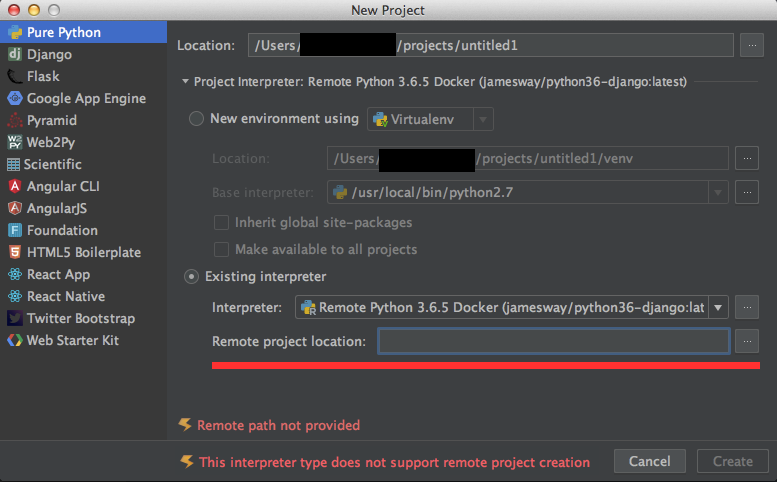
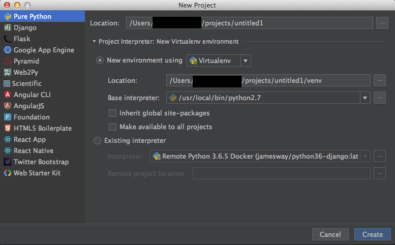
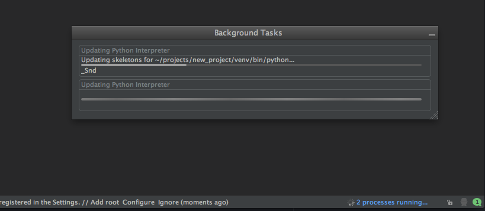
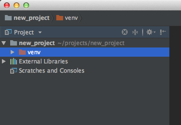
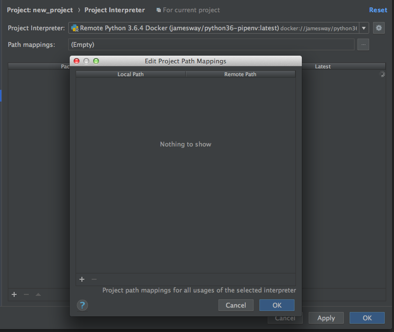
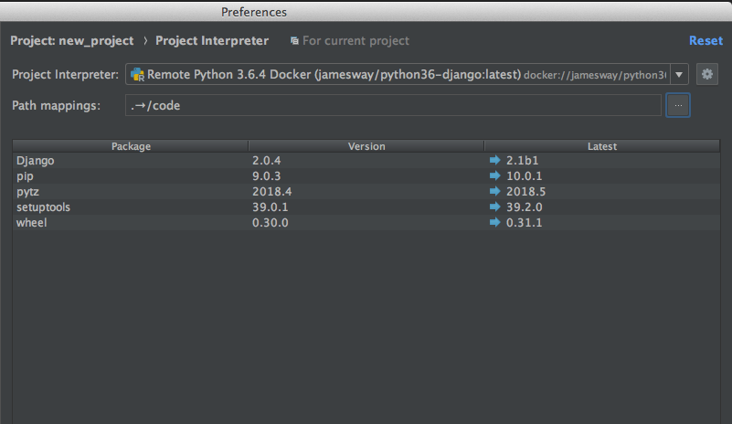
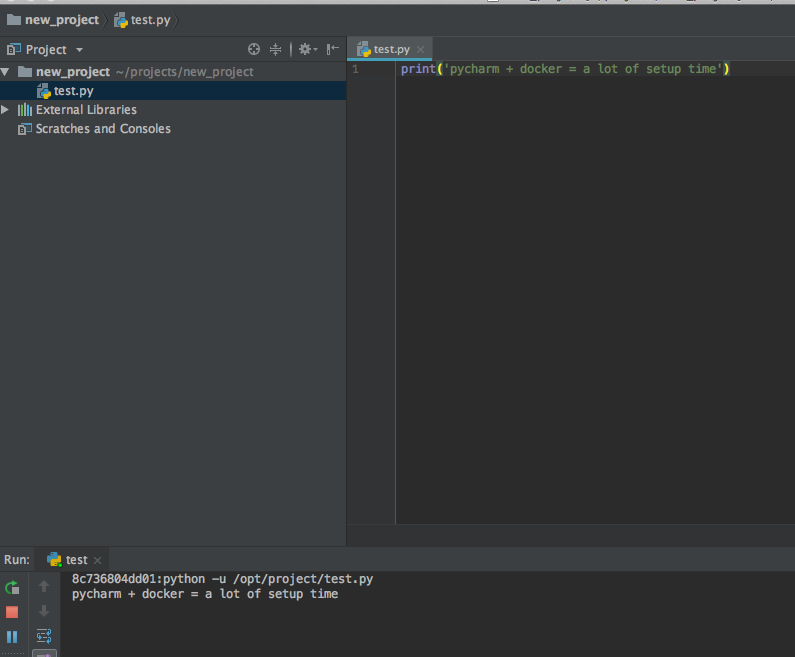

# Getting Pycharm (OS X) to work with Docker

## The Problem

When you start a project with your nice shiny docker image selected as the remote interpreter you'll probably see...  

  

You might even try to add a path for the project location. It won't work.  
You'll get a "This interpreter type..." error instead of the "Remote path" error.

## The Hack

### 1) Start the project with a virtual environment  

### 2) Delete out the venv directory after the scans finish
  

### 3) In preferences, select your docker image as the interpreter
- make sure to add the paths
- wait for Pycharm to find the packages

  

### 4) Success

Your project is using a python docker image.  

  

if you see the container id, you're set
